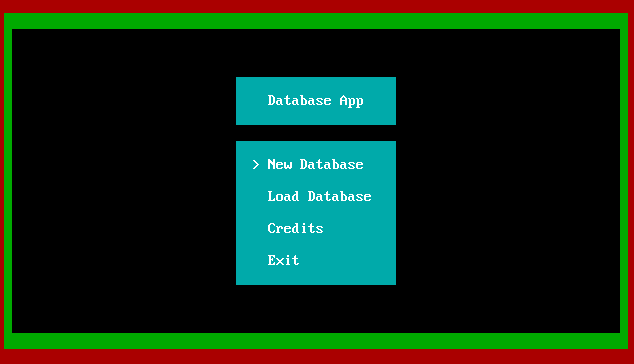

<h1 align="center">
QBCRUD
</h1>

          

QBCRUD was an application I wrote for a project at school. The program implements CRUD actions allowing users to manipulate data represented in tables. It's still quite basic, most of the project deals with UI more than CRUD actions. It has basic validation and error handling functionality however I don't thing there is a single line of comment anywhere. I am still proud of what I could achieve operating entirely inside the QBASIC 4.5 interpreter even though the program has a few hacky edges.

          

## Tested On

- [x]  Windows (on DOSBox 0.74)
- [ ]  macOS
- [ ]  Linux

## Installation

Installation is quite easy:
1. Install DOSBox and then download QB 4.5 (or just use this: [QB + DOS installer](https://bit.ly/2UA57vP)).
2. Run QB 4.5 from within DOSBox and open the PROJ.BAS file from within the QB interpreter.

Note: The .BAS file needs to be placed in the same directory as QB.EXE

## Roadmap

None! This project is as complete as it will ever be!
